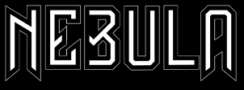
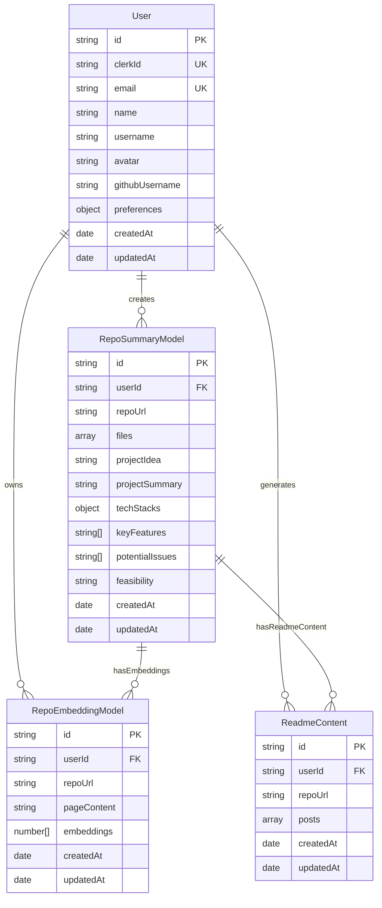
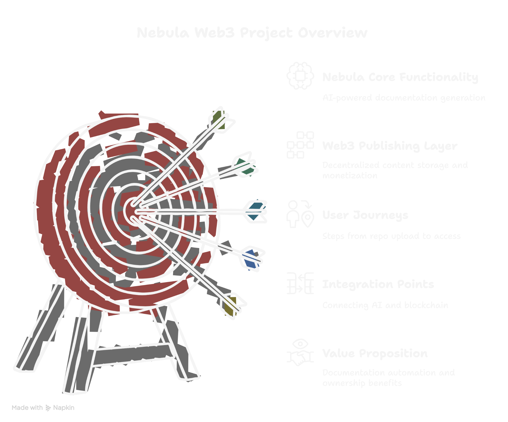

# Nebula ✨ 

<div align="center">



<h3>Transform Code into Comprehensive Documentation with AI</h3>

[](https://nextjs.org/)
[](https://www.mongodb.com/)
[](https://clerk.dev/)
[](https://tailwindcss.com/)

</div>

Nebula transforms complicated repositories into elegant documentation with AI-powered analysis. It automatically generates professional READMEs, technical articles, and social media content from your code, saving countless hours of manual documentation work. With just a URL, unlock comprehensive insights into any repository's architecture, features, and implementation details.

## 🎬 Demos & Resources

<div style="display: flex; flex-wrap: wrap; gap: 20px; margin: 30px 0;">
  <div style="flex: 1; min-width: 300px;">
    <div style="border: 1px solid #e1e4e8; border-radius: 10px; overflow: hidden;">
      <div style="background-color: rgba(79, 70, 229, 0.1); padding: 15px; border-bottom: 1px solid #e1e4e8;">
        <h3 style="margin: 0; display: flex; align-items: center; gap: 10px;">
          <svg width="24" height="24" viewBox="0 0 24 24" fill="none" xmlns="http://www.w3.org/2000/svg">
            <path d="M12 2C6.48 2 2 6.48 2 12C2 17.52 6.48 22 12 22C17.52 22 22 17.52 22 12C22 6.48 17.52 2 12 2ZM10 16.5V7.5L16 12L10 16.5Z" fill="#4F46E5"/>
          </svg>
          Demo Videos
        </h3>
      </div>
      <div style="padding: 20px;">
        <p><strong>Web3 Implementation Demo:</strong></p>
        <a href="https://github.com/user-attachments/assets/cc7536fc-d537-4a22-a198-315105df3ff4" style="display: block; padding: 10px; background-color: rgba(0,0,0,0.02); border-radius: 5px; margin-bottom: 15px; text-decoration: none; color: inherit;">
          <div style="display: flex; align-items: center; gap: 10px;">
            <svg width="24" height="24" viewBox="0 0 24 24" fill="none" xmlns="http://www.w3.org/2000/svg">
              <path d="M21 3H3C1.9 3 1 3.9 1 5V19C1 20.1 1.9 21 3 21H21C22.1 21 23 20.1 23 19V5C23 3.9 22.1 3 21 3ZM21 19H3V5H21V19ZM9 8H11V16H9V8ZM13 8H15V16H13V8Z" fill="#6e7681"/>
            </svg>
            <span>View Web3 Implementation Demo</span>
          </div>
        </a>        <p><strong>Full Demo Video:</strong></p>
        <a href="https://drive.google.com/file/d/1a3ZxPlgpctzU4tKBbkjsQBbFNSNb6YI5/view" style="display: block; padding: 10px; background-color: rgba(0,0,0,0.02); border-radius: 5px; margin-bottom: 15px; text-decoration: none; color: inherit;">
          <div style="display: flex; align-items: center; gap: 10px;">
            <svg width="24" height="24" viewBox="0 0 24 24" fill="none" xmlns="http://www.w3.org/2000/svg">
              <path d="M12 2C6.48 2 2 6.48 2 12C2 17.52 6.48 22 12 22C17.52 22 22 17.52 22 12C22 6.48 17.52 2 12 2ZM10 16.5V7.5L16 12L10 16.5Z" fill="#6e7681"/>
            </svg>
            <span>View Full Demo Video</span>
          </div>
        </a>
        <p><strong>Pitch Video:</strong></p>
        <a href="https://github.com/user-attachments/assets/550784a7-0c56-4bb0-a4f4-ee1e94973ac9" style="display: block; padding: 10px; background-color: rgba(0,0,0,0.02); border-radius: 5px; text-decoration: none; color: inherit;">
          <div style="display: flex; align-items: center; gap: 10px;">
            <svg width="24" height="24" viewBox="0 0 24 24" fill="none" xmlns="http://www.w3.org/2000/svg">
              <path d="M4 6H2V20C2 21.1 2.9 22 4 22H18V20H4V6Z M20 2H8C6.9 2 6 2.9 6 4V16C6 17.1 6.9 18 8 18H20C21.1 18 22 17.1 22 16V4C22 2.9 21.1 2 20 2ZM20 16H8V4H20V16ZM12 5.5V14.5L18 10L12 5.5Z" fill="#6e7681"/>
            </svg>
            <span>View Full Pitch Video</span>
          </div>
        </a>
      </div>
    </div>
  </div>

  <div style="flex: 1; min-width: 300px;">
    <div style="border: 1px solid #e1e4e8; border-radius: 10px; overflow: hidden;">
      <div style="background-color: rgba(79, 70, 229, 0.1); padding: 15px; border-bottom: 1px solid #e1e4e8;">
        <h3 style="margin: 0; display: flex; align-items: center; gap: 10px;">
          <svg width="24" height="24" viewBox="0 0 24 24" fill="none" xmlns="http://www.w3.org/2000/svg">
            <path d="M12 2C6.48 2 2 6.48 2 12C2 16.42 4.87 20.17 8.84 21.5C9.34 21.58 9.5 21.27 9.5 21C9.5 20.77 9.5 20.14 9.5 19.31C6.73 19.91 6.14 17.97 6.14 17.97C5.68 16.81 5.03 16.5 5.03 16.5C4.12 15.88 5.1 15.9 5.1 15.9C6.1 15.97 6.63 16.93 6.63 16.93C7.5 18.45 8.97 18 9.54 17.76C9.63 17.11 9.89 16.67 10.17 16.42C7.95 16.17 5.62 15.31 5.62 11.5C5.62 10.39 6 9.5 6.65 8.79C6.55 8.54 6.2 7.5 6.75 6.15C6.75 6.15 7.59 5.88 9.5 7.17C10.29 6.95 11.15 6.84 12 6.84C12.85 6.84 13.71 6.95 14.5 7.17C16.41 5.88 17.25 6.15 17.25 6.15C17.8 7.5 17.45 8.54 17.35 8.79C18 9.5 18.38 10.39 18.38 11.5C18.38 15.32 16.04 16.16 13.81 16.41C14.17 16.72 14.5 17.33 14.5 18.26C14.5 19.6 14.5 20.68 14.5 21C14.5 21.27 14.66 21.59 15.17 21.5C19.14 20.16 22 16.42 22 12C22 6.48 17.52 2 12 2Z" fill="#4F46E5"/>
          </svg>
          Project Repositories
        </h3>
      </div>
      <div style="padding: 20px;">
        <div style="display: flex; flex-direction: column; gap: 15px;">
          <div style="padding: 15px; border: 1px solid #e1e4e8; border-radius: 5px; background-color: rgba(0,0,0,0.02);">
            <h4 style="margin-top: 0;">Nebula Frontend</h4>
            <p style="margin-bottom: 10px;">Main repository with Next.js frontend components</p>
            <a href="https://github.com/K-is-SAD/Github" style="display: flex; align-items: center; gap: 5px; color: #4F46E5; text-decoration: none;">
              <svg width="16" height="16" viewBox="0 0 24 24" fill="none" xmlns="http://www.w3.org/2000/svg">
                <path d="M19 19H5V5H12V3H5C3.89 3 3 3.9 3 5V19C3 20.1 3.89 21 5 21H19C20.1 21 21 20.1 21 19V12H19V19ZM14 3V5H17.59L7.76 14.83L9.17 16.24L19 6.41V10H21V3H14Z" fill="#4F46E5"/>
              </svg>
              View Repository
            </a>
          </div>
          <div style="padding: 15px; border: 1px solid #e1e4e8; border-radius: 5px; background-color: rgba(0,0,0,0.02);">
            <h4 style="margin-top: 0;">Nebula Backend</h4>
            <p style="margin-bottom: 10px;">Backend API services and database connections</p>
            <a href="https://github.com/K-is-SAD/Nebula-backend" style="display: flex; align-items: center; gap: 5px; color: #4F46E5; text-decoration: none;">
              <svg width="16" height="16" viewBox="0 0 24 24" fill="none" xmlns="http://www.w3.org/2000/svg">
                <path d="M19 19H5V5H12V3H5C3.89 3 3 3.9 3 5V19C3 20.1 3.89 21 5 21H19C20.1 21 21 20.1 21 19V12H19V19ZM14 3V5H17.59L7.76 14.83L9.17 16.24L19 6.41V10H21V3H14Z" fill="#4F46E5"/>
              </svg>
              View Repository
            </a>
          </div>
          <div style="padding: 15px; border: 1px solid #e1e4e8; border-radius: 5px; background-color: rgba(0,0,0,0.02);">
            <h4 style="margin-top: 0;">Nebula Contracts</h4>
            <p style="margin-bottom: 10px;">Smart contracts for Web3 functionality</p>
            <a href="https://github.com/K-is-SAD/Nebula-contracts" style="display: flex; align-items: center; gap: 5px; color: #4F46E5; text-decoration: none;">
              <svg width="16" height="16" viewBox="0 0 24 24" fill="none" xmlns="http://www.w3.org/2000/svg">
                <path d="M19 19H5V5H12V3H5C3.89 3 3 3.9 3 5V19C3 20.1 3.89 21 5 21H19C20.1 21 21 20.1 21 19V12H19V19ZM14 3V5H17.59L7.76 14.83L9.17 16.24L19 6.41V10H21V3H14Z" fill="#4F46E5"/>
              </svg>
              View Repository
            </a>
          </div>
          <div style="padding: 15px; border: 1px solid #e1e4e8; border-radius: 5px; background-color: rgba(0,0,0,0.02);">
            <h4 style="margin-top: 0;">Nebula DApp</h4>
            <p style="margin-bottom: 10px;">Decentralized application interface</p>
            <a href="https://github.com/K-is-SAD/nebula-dapp" style="display: flex; align-items: center; gap: 5px; color: #4F46E5; text-decoration: none;">
              <svg width="16" height="16" viewBox="0 0 24 24" fill="none" xmlns="http://www.w3.org/2000/svg">
                <path d="M19 19H5V5H12V3H5C3.89 3 3 3.9 3 5V19C3 20.1 3.89 21 5 21H19C20.1 21 21 20.1 21 19V12H19V19ZM14 3V5H17.59L7.76 14.83L9.17 16.24L19 6.41V10H21V3H14Z" fill="#4F46E5"/>
              </svg>
              View Repository
            </a>
          </div>
        </div>
      </div>
    </div>
    <div style="border: 1px solid #e1e4e8; border-radius: 10px; overflow: hidden; margin-top: 20px;">
      <div style="background-color: rgba(79, 70, 229, 0.1); padding: 15px; border-bottom: 1px solid #e1e4e8;">
        <h3 style="margin: 0; display: flex; align-items: center; gap: 10px;">
          <svg width="24" height="24" viewBox="0 0 24 24" fill="none" xmlns="http://www.w3.org/2000/svg">
            <path d="M19 3H5C3.9 3 3 3.9 3 5V19C3 20.1 3.9 21 5 21H19C20.1 21 21 20.1 21 19V5C21 3.9 20.1 3 19 3ZM19 19H5V5H19V19ZM13.96 12.29L11.21 15.83L9.25 13.47L6.5 17H17.5L13.96 12.29Z" fill="#4F46E5"/>
          </svg>
          Presentation
        </h3>
      </div>
      <div style="padding: 20px;">
        <a href="https://docs.google.com/presentation/d/113Yj6llw11j9YufFFc9Kj90Pxq5jBMTREmNhik9NhVw/edit?usp=sharing" style="display: block; padding: 10px; background-color: rgba(0,0,0,0.02); border-radius: 5px; text-decoration: none; color: inherit;">
          <div style="display: flex; align-items: center; gap: 10px;">
            <svg width="24" height="24" viewBox="0 0 24 24" fill="none" xmlns="http://www.w3.org/2000/svg">
              <path d="M19 3H5C3.9 3 3 3.9 3 5V19C3 20.1 3.9 21 5 21H19C20.1 21 21 20.1 21 19V5C21 3.9 20.1 3 19 3ZM19 19H5V5H19V19ZM13.96 12.29L11.21 15.83L9.25 13.47L6.5 17H17.5L13.96 12.29Z" fill="#6e7681"/>
            </svg>
            <span>View Presentation Slides</span>
          </div>
        </a>
      </div>
    </div>
  </div>
</div>

<div style="text-align: center; margin: 40px 0; padding: 20px; background-color: rgba(79, 70, 229, 0.05); border-radius: 10px;">
  <h3 style="font-size: 1.5em; margin-bottom: 15px;">Your code tells a story. We just make sure everyone understands it.</h3>
  <p style="font-style: italic; color: #6e7681; max-width: 600px; margin: 0 auto;">Nebula transforms complex code into clear, comprehensive documentation that makes your projects accessible to everyone.</p>
</div>


## 📑 Table of Contents

<div style="display: flex; flex-wrap: wrap; gap: 10px; justify-content: center; margin: 30px 0;">
  <a href="#overview" style="display: flex; align-items: center; gap: 5px; padding: 8px 16px; background-color: rgba(79, 70, 229, 0.1); border-radius: 20px; text-decoration: none; color: #4F46E5; font-weight: bold;">
    <span style="font-size: 1.2em;">🚀</span> Overview
  </a>
  <a href="#key-features" style="display: flex; align-items: center; gap: 5px; padding: 8px 16px; background-color: rgba(79, 70, 229, 0.1); border-radius: 20px; text-decoration: none; color: #4F46E5; font-weight: bold;">
    <span style="font-size: 1.2em;">🔥</span> Key Features
  </a>
  <a href="#demo" style="display: flex; align-items: center; gap: 5px; padding: 8px 16px; background-color: rgba(79, 70, 229, 0.1); border-radius: 20px; text-decoration: none; color: #4F46E5; font-weight: bold;">
    <span style="font-size: 1.2em;">📺</span> Demo
  </a>
  <a href="#ppt" style="display: flex; align-items: center; gap: 5px; padding: 8px 16px; background-color: rgba(79, 70, 229, 0.1); border-radius: 20px; text-decoration: none; color: #4F46E5; font-weight: bold;">
    <span style="font-size: 1.2em;">📊</span> PPT
  </a>
  <a href="#tech-stack" style="display: flex; align-items: center; gap: 5px; padding: 8px 16px; background-color: rgba(79, 70, 229, 0.1); border-radius: 20px; text-decoration: none; color: #4F46E5; font-weight: bold;">
    <span style="font-size: 1.2em;">💻</span> Tech Stack
  </a>
  <a href="#system-architecture" style="display: flex; align-items: center; gap: 5px; padding: 8px 16px; background-color: rgba(79, 70, 229, 0.1); border-radius: 20px; text-decoration: none; color: #4F46E5; font-weight: bold;">
    <span style="font-size: 1.2em;">🏗️</span> System Architecture
  </a>
  <a href="#installation" style="display: flex; align-items: center; gap: 5px; padding: 8px 16px; background-color: rgba(79, 70, 229, 0.1); border-radius: 20px; text-decoration: none; color: #4F46E5; font-weight: bold;">
    <span style="font-size: 1.2em;">📥</span> Installation
  </a>
  <a href="#usage" style="display: flex; align-items: center; gap: 5px; padding: 8px 16px; background-color: rgba(79, 70, 229, 0.1); border-radius: 20px; text-decoration: none; color: #4F46E5; font-weight: bold;">
    <span style="font-size: 1.2em;">📖</span> Usage
  </a>
  <a href="#web3-integration" style="display: flex; align-items: center; gap: 5px; padding: 8px 16px; background-color: rgba(79, 70, 229, 0.1); border-radius: 20px; text-decoration: none; color: #4F46E5; font-weight: bold;">
    <span style="font-size: 1.2em;">⛓️</span> Web3
  </a>
  <a href="#project-structure" style="display: flex; align-items: center; gap: 5px; padding: 8px 16px; background-color: rgba(79, 70, 229, 0.1); border-radius: 20px; text-decoration: none; color: #4F46E5; font-weight: bold;">
    <span style="font-size: 1.2em;">📁</span> Project Structure
  </a>
  <a href="#api-reference" style="display: flex; align-items: center; gap: 5px; padding: 8px 16px; background-color: rgba(79, 70, 229, 0.1); border-radius: 20px; text-decoration: none; color: #4F46E5; font-weight: bold;">
    <span style="font-size: 1.2em;">🔌</span> API Reference
  </a>
  <a href="#faq" style="display: flex; align-items: center; gap: 5px; padding: 8px 16px; background-color: rgba(79, 70, 229, 0.1); border-radius: 20px; text-decoration: none; color: #4F46E5; font-weight: bold;">
    <span style="font-size: 1.2em;">🔍</span> FAQ
  </a>
  <a href="#roadmap" style="display: flex; align-items: center; gap: 5px; padding: 8px 16px; background-color: rgba(79, 70, 229, 0.1); border-radius: 20px; text-decoration: none; color: #4F46E5; font-weight: bold;">
    <span style="font-size: 1.2em;">🛣️</span> Roadmap
  </a>
  <a href="#contributing" style="display: flex; align-items: center; gap: 5px; padding: 8px 16px; background-color: rgba(79, 70, 229, 0.1); border-radius: 20px; text-decoration: none; color: #4F46E5; font-weight: bold;">
    <span style="font-size: 1.2em;">👥</span> Contributing
  </a>
  <a href="#license" style="display: flex; align-items: center; gap: 5px; padding: 8px 16px; background-color: rgba(79, 70, 229, 0.1); border-radius: 20px; text-decoration: none; color: #4F46E5; font-weight: bold;">
    <span style="font-size: 1.2em;">📜</span> License
  </a>
  <a href="#contact" style="display: flex; align-items: center; gap: 5px; padding: 8px 16px; background-color: rgba(79, 70, 229, 0.1); border-radius: 20px; text-decoration: none; color: #4F46E5; font-weight: bold;">
    <span style="font-size: 1.2em;">📬</span> Contact
  </a>
</div>


## 🚀 Overview

<div style="display: flex; justify-content: space-between; align-items: center; margin: 30px 0;">
  <div style="flex: 1; padding-right: 20px;">
    <p>Nebula is a powerful documentation generation tool that analyzes GitHub repositories and creates comprehensive documentation automatically. The platform uses advanced AI to understand code structure, extract meaningful insights, and generate various documentation formats that are ready to use.</p>
    <p>The application addresses the challenge developers face when needing to create and maintain documentation for their projects. Instead of spending hours writing READMEs, technical articles, and other documentation, Nebula allows you to generate professional content with just one click.</p>
    <h3>Why Nebula?</h3>
    <ul>
      <li>📊 <strong>Save Time:</strong> Reduce documentation time from hours to minutes</li>
      <li>🌍 <strong>Improve Developer Experience:</strong> Make your projects more accessible to contributors</li>
      <li>🤝 <strong>Enhance Collaboration:</strong> Clear documentation facilitates better team collaboration</li>
      <li>🔍 <strong>Increase Project Visibility:</strong> Well-documented repos attract more users and contributors</li>
    </ul>
  </div>
  <div style="flex: 1; text-align: center;">
    
  </div>
</div>

## 🔥 Key Features

<div class="features-grid" style=" display: flex; gap: 20px; flex-wrap: wrap; margin: 20px 0;">

<div class="feature-card" style="padding: 20px; border: 1px solid #e1e4e8; border-radius: 10px; background: rgba(255,255,255,0.05);">
  <h3>🤖 AI-Powered Repository Analysis</h3>
  <p>Deep analysis of code structure, dependencies, and patterns using advanced machine learning models to extract meaningful insights.</p>
</div>

<div class="feature-card" style="padding: 20px; border: 1px solid #e1e4e8; border-radius: 10px; background: rgba(255,255,255,0.05);">
  <h3>📝 Automated README Generation</h3>
  <p>Create professional README files with all necessary sections structured according to best practices in documentation.</p>
</div>

<div class="feature-card" style="padding: 20px; border: 1px solid #e1e4e8; border-radius: 10px; background: rgba(255,255,255,0.05);">
  <h3>📚 Technical Article Creation</h3>
  <p>Generate detailed technical articles about implementation, architecture decisions, and code patterns found in your repository.</p>
</div>

<div class="feature-card" style="padding: 20px; border: 1px solid #e1e4e8; border-radius: 10px; background: rgba(255,255,255,0.05);">
  <h3>🗂️ Content Organization</h3>
  <p>Categorize documentation by type and purpose, making it easy to find specific information about your codebase.</p>
</div>

<div class="feature-card" style="padding: 20px; border: 1px solid #e1e4e8; border-radius: 10px; background: rgba(255,255,255,0.05);">
  <h3>✏️ Section-Based Editing</h3>
  <p>Easily edit specific sections of your documentation without having to rewrite everything from scratch.</p>
</div>

<div class="feature-card" style="padding: 20px; border: 1px solid #e1e4e8; border-radius: 10px; background: rgba(255,255,255,0.05);">
  <h3>👁️ Preview Mode</h3>
  <p>See rendered markdown as you work, ensuring your documentation looks great before publishing.</p>
</div>

<div class="feature-card" style="padding: 20px; border: 1px solid #e1e4e8; border-radius: 10px; background: rgba(255,255,255,0.05);">
  <h3>📥 Export Functionality</h3>
  <p>Download documentation in markdown format for easy integration into your GitHub repositories.</p>
</div>

<div class="feature-card" style="padding: 20px; border: 1px solid #e1e4e8; border-radius: 10px; background: rgba(255,255,255,0.05);">
  <h3>📜 Repository History</h3>
  <p>Access previously generated documentation for all your repositories in one centralized location.</p>
</div>

<div class="feature-card" style="padding: 20px; border: 1px solid #e1e4e8; border-radius: 10px; background: rgba(255,255,255,0.05);">
  <h3>🌓 Dark/Light Mode Support</h3>
  <p>Comfortable viewing in any environment with seamless theme switching to match your preferences.</p>
</div>

<div class="feature-card" style="padding: 20px; border: 1px solid #e1e4e8; border-radius: 10px; background: rgba(255,255,255,0.05);">
  <h3>💬 AI-Powered Chat</h3>
  <p>Interact with your codebase through natural language queries to quickly find information and generate documentation.</p>
</div>

<div class="feature-card" style="padding: 20px; border: 1px solid #e1e4e8; border-radius: 10px; background: rgba(255,255,255,0.05);">
  <h3>🔗 Social Media Integration</h3>
  <p>Generate professional posts for LinkedIn, Twitter, and other platforms to showcase your projects effectively.</p>
</div>

</div>

## 💻 Tech Stack

<table>
  <tr>
    <td align="center" width="20%">
      
      <br>
      Next.js
    </td>
    <td align="center" width="20%">
      
      <br>
      React
    </td>
    <td align="center" width="20%">
      
      <br>
      TailwindCSS
    </td>
    <td align="center" width="20%">
      
      <br>
      Node.js
    </td>
    <td align="center" width="20%">
      
      <br>
      Express
    </td>
  </tr>
  <tr>
    <td align="center">
      
      <br>
      MongoDB
    </td>
    <td align="center">
      
      <br>
      Clerk Auth
    </td>
    <td align="center">
      
      <br>
      Custom NLP Models
    </td>
    <td align="center">
      
      <br>
      Vercel
    </td>
    <td align="center">
      
      <br>
      Railway
    </td>
  </tr>
  <tr>
    <td align="center">
      
      <br>
      React Markdown
    </td>
    <td align="center">
      
      <br>
      Lucide Icons
    </td>
    <td align="center">
      
      <br>
      Solidity
    </td>
    <td align="center">
      
      <br>
      ThirdWeb
    </td>
    <td align="center">
      
      <br>
      TypeScript
    </td>
  </tr>
</table>

## 🏗️ System Architecture

<div style="background-color: rgba(0,0,0,0.02); border-radius: 10px; padding: 20px; margin-bottom: 30px;">
  <h3>Architecture Overview</h3>
  <p>Nebula follows a modern microservices architecture with the following key components:</p>
  
  <div style="display: flex; flex-wrap: wrap; gap: 15px; margin-top: 15px;">
    <div style="flex: 1; min-width: 200px; background-color: rgba(79, 70, 229, 0.1); padding: 12px; border-radius: 8px;">
      <h4>Frontend (Next.js)</h4>
      <p>User interface for repository analysis and content generation</p>
    </div>
    <div style="flex: 1; min-width: 200px; background-color: rgba(16, 185, 129, 0.1); padding: 12px; border-radius: 8px;">
      <h4>Backend API (Node.js)</h4>
      <p>Handles authentication, data management, and content storage</p>
    </div>
    <div style="flex: 1; min-width: 200px; background-color: rgba(245, 158, 11, 0.1); padding: 12px; border-radius: 8px;">
      <h4>AI Service</h4>
      <p>Processes code repositories and generates documentation content</p>
    </div>
    <div style="flex: 1; min-width: 200px; background-color: rgba(6, 182, 212, 0.1); padding: 12px; border-radius: 8px;">
      <h4>Database Layer</h4>
      <p>MongoDB for data persistence and vector database for embeddings</p>
    </div>
  </div>
</div>

<div style="text-align: center; margin: 20px 0 30px 0;">
  <h3>Data Flow Diagram</h3>
  
</div>

<h3>Database Schema</h3>



<div style="margin-top: 30px;">
  <h3>Key Components</h3>
  <div style="display: flex; flex-wrap: wrap; gap: 20px;">
    <div style="flex: 1; min-width: 280px; border: 1px solid #e1e4e8; border-radius: 10px; padding: 15px;">
      <h4>Authentication System</h4>
      <p>Nebula uses Clerk for secure user authentication with support for multiple providers:</p>
      <ul>
        <li>Email/Password</li>
        <li>OAuth (GitHub, Google)</li>
        <li>Session management</li>
      </ul>
    </div>
    <div style="flex: 1; min-width: 280px; border: 1px solid #e1e4e8; border-radius: 10px; padding: 15px;">
      <h4>Repository Analysis</h4>
      <p>The system analyzes repositories through:</p>
      <ul>
        <li>Code structure parsing</li>
        <li>Dependency analysis</li>
        <li>Feature extraction</li>
        <li>Technology stack identification</li>
      </ul>
    </div>
    <div style="flex: 1; min-width: 280px; border: 1px solid #e1e4e8; border-radius: 10px; padding: 15px;">
      <h4>Content Generation</h4>
      <p>AI-powered content generation includes:</p>
      <ul>
        <li>README documents</li>
        <li>Technical articles</li>
        <li>Social media posts</li>
        <li>Project presentations</li>
      </ul>
    </div>
  </div>
</div>
```

## 📥 Installation

<div style="background-color: rgba(0,0,0,0.05); border-radius: 10px; padding: 20px; margin-bottom: 20px;">
  <h3>Prerequisites</h3>
  <ul>
    <li>Node.js v16.x or later</li>
    <li>MongoDB instance (local or cloud)</li>
    <li><a href="https://clerk.dev/">Clerk</a> account for authentication</li>
    <li>Git</li>
  </ul>
</div>

<div style="display: flex; gap: 20px; flex-wrap: wrap;">
  <div style="flex: 1; min-width: 300px;">
    <h3>Step 1: Clone the repository</h3>
    
```bash
# Clone the repository
git clone https://github.com/K-is-SAD/Github

# Navigate to project directory
cd Github
```
  </div>

  <div style="flex: 1; min-width: 300px;">
    <h3>Step 2: Install dependencies</h3>
    
```bash
# Install all required packages
npm install
```
  </div>
</div>

<div style="display: flex; gap: 20px; flex-wrap: wrap; margin-top: 20px;">
  <div style="flex: 1; min-width: 300px;">
    <h3>Step 3: Configure environment</h3>
    
```bash
# Create environment file from example
cp .env.example .env

# Open the file and add your credentials
# nano .env or open in your favorite editor
```
  </div>

  <div style="flex: 1; min-width: 300px;">
    <h3>Step 4: Start development server</h3>
    
```bash
# Run the development server
npm run dev

# The app will be available at http://localhost:3000
```
  </div>
</div>

<div style="background-color: rgba(255, 255, 0, 0.1); border-left: 4px solid #ffd700; padding: 15px; margin-top: 20px;">
  <h3>Required Environment Variables</h3>
  <table>
    <tr>
      <th>Variable Name</th>
      <th>Description</th>
      <th>Where to Get It</th>
    </tr>
    <tr>
      <td><code>NEXT_PUBLIC_CLERK_PUBLISHABLE_KEY</code></td>
      <td>Public key for Clerk authentication</td>
      <td><a href="https://dashboard.clerk.dev/">Clerk Dashboard</a></td>
    </tr>
    <tr>
      <td><code>CLERK_SECRET_KEY</code></td>
      <td>Secret key for Clerk authentication</td>
      <td><a href="https://dashboard.clerk.dev/">Clerk Dashboard</a></td>
    </tr>
    <tr>
      <td><code>MONGODB_URI</code></td>
      <td>MongoDB connection string</td>
      <td><a href="https://www.mongodb.com/cloud/atlas">MongoDB Atlas</a> or local installation</td>
    </tr>
    <tr>
      <td><code>WEBHOOK_SECRET</code></td>
      <td>Secret for webhook verification</td>
      <td>Generate a random string</td>
    </tr>
    <tr>
      <td><code>API_URL</code></td>
      <td>Backend API URL</td>
      <td>Your backend deployment URL</td>
    </tr>
    <tr>
      <td><code>NEXT_PUBLIC_PYTHON_BACKEND_URL</code></td>
      <td>Python backend service URL</td>
      <td>Python backend deployment URL</td>
    </tr>
  </table>
</div>

## 📖 Usage

<div style="text-align: center; padding: 20px; margin-bottom: 30px; background: linear-gradient(120deg, rgba(255,255,255,0.1), rgba(255,255,255,0.3)); border-radius: 10px;">
  <h3>🚀 Quick Start Guide</h3>
  <p>Get started with Nebula in just a few steps</p>
  <div style="display: flex; justify-content: space-around; flex-wrap: wrap; margin-top: 20px;">
    <div style="text-align: center; margin: 10px; max-width: 140px;">
      <div style="width: 60px; height: 60px; border-radius: 50%; background-color: #4F46E5; color: white; display: flex; align-items: center; justify-content: center; margin: 0 auto; font-size: 24px; font-weight: bold;">1</div>
      <p><strong>Sign In</strong></p>
    </div>
    <div style="text-align: center; margin: 10px; max-width: 140px;">
      <div style="width: 60px; height: 60px; border-radius: 50%; background-color: #4F46E5; color: white; display: flex; align-items: center; justify-content: center; margin: 0 auto; font-size: 24px; font-weight: bold;">2</div>
      <p><strong>Add Repository</strong></p>
    </div>
    <div style="text-align: center; margin: 10px; max-width: 140px;">
      <div style="width: 60px; height: 60px; border-radius: 50%; background-color: #4F46E5; color: white; display: flex; align-items: center; justify-content: center; margin: 0 auto; font-size: 24px; font-weight: bold;">3</div>
      <p><strong>Analyze</strong></p>
    </div>
    <div style="text-align: center; margin: 10px; max-width: 140px;">
      <div style="width: 60px; height: 60px; border-radius: 50%; background-color: #4F46E5; color: white; display: flex; align-items: center; justify-content: center; margin: 0 auto; font-size: 24px; font-weight: bold;">4</div>
      <p><strong>Generate Content</strong></p>
    </div>
    <div style="text-align: center; margin: 10px; max-width: 140px;">
      <div style="width: 60px; height: 60px; border-radius: 50%; background-color: #4F46E5; color: white; display: flex; align-items: center; justify-content: center; margin: 0 auto; font-size: 24px; font-weight: bold;">5</div>
      <p><strong>Export</strong></p>
    </div>
  </div>
</div>

### 🔍 Analyzing a Repository

<div class="steps-container" style="margin-left: 20px;">
  <div class="step" style="margin-bottom: 15px; position: relative; padding-left: 30px;">
    <div style="position: absolute; left: 0; top: 0; width: 24px; height: 24px; border-radius: 50%; background-color: #4F46E5; color: white; display: flex; align-items: center; justify-content: center; font-size: 14px; font-weight: bold;">1</div>
    <p><strong>Sign in</strong> with your account using Clerk authentication</p>
  </div>
  <div class="step" style="margin-bottom: 15px; position: relative; padding-left: 30px;">
    <div style="position: absolute; left: 0; top: 0; width: 24px; height: 24px; border-radius: 50%; background-color: #4F46E5; color: white; display: flex; align-items: center; justify-content: center; font-size: 14px; font-weight: bold;">2</div>
    <p>Navigate to the <strong>editor page</strong> from the main navigation menu</p>
  </div>
  <div class="step" style="margin-bottom: 15px; position: relative; padding-left: 30px;">
    <div style="position: absolute; left: 0; top: 0; width: 24px; height: 24px; border-radius: 50%; background-color: #4F46E5; color: white; display: flex; align-items: center; justify-content: center; font-size: 14px; font-weight: bold;">3</div>
    <p>Click <strong>"Set Repository URL"</strong> and enter or select a GitHub repository URL from the dropdown</p>
  </div>
  <div class="step" style="margin-bottom: 15px; position: relative; padding-left: 30px;">
    <div style="position: absolute; left: 0; top: 0; width: 24px; height: 24px; border-radius: 50%; background-color: #4F46E5; color: white; display: flex; align-items: center; justify-content: center; font-size: 14px; font-weight: bold;">4</div>
    <p><strong>Wait for analysis</strong> as the system analyzes the repository and generates documentation</p>
  </div>
  <div class="step" style="margin-bottom: 15px; position: relative; padding-left: 30px;">
    <div style="position: absolute; left: 0; top: 0; width: 24px; height: 24px; border-radius: 50%; background-color: #4F46E5; color: white; display: flex; align-items: center; justify-content: center; font-size: 14px; font-weight: bold;">5</div>
    <p><strong>Review and edit</strong> the generated content as needed before saving or exporting</p>
  </div>
  <div class="step" style="margin-bottom: 15px; position: relative; padding-left: 30px;">
    <div style="position: absolute; left: 0; top: 0; width: 24px; height: 24px; border-radius: 50%; background-color: #4F46E5; color: white; display: flex; align-items: center; justify-content: center; font-size: 14px; font-weight: bold;">6</div>
    <p><strong>Save or export</strong> your documentation for future reference or immediate use</p>
  </div>
</div>

### ✏️ Editing Documentation

<div style="display: flex; gap: 20px; flex-wrap: wrap; margin: 20px 0;">
  <div style="flex: 1; min-width: 300px; background-color: rgba(255,255,255,0.05); padding: 15px; border-radius: 8px; border-left: 4px solid #4F46E5;">
    <h4>1. Edit Mode</h4>
    <p>Use the "Edit" mode to modify content with a full-featured markdown editor</p>
    <p><small>Click the <code>Code</code> icon in the editor to switch to edit mode</small></p>
  </div>
  <div style="flex: 1; min-width: 300px; background-color: rgba(255,255,255,0.05); padding: 15px; border-radius: 8px; border-left: 4px solid #4F46E5;">
    <h4>2. Preview Mode</h4>
    <p>Toggle to "Preview" mode to see how your markdown will render when published</p>
    <p><small>Click the <code>Eye</code> icon in the editor to switch to preview mode</small></p>
  </div>
</div>

<div style="display: flex; gap: 20px; flex-wrap: wrap; margin: 20px 0;">
  <div style="flex: 1; min-width: 300px; background-color: rgba(255,255,255,0.05); padding: 15px; border-radius: 8px; border-left: 4px solid #4F46E5;">
    <h4>3. Section-Based Editing</h4>
    <p>Edit individual sections or the entire document based on your needs</p>
    <p><small>Click on any section in the sidebar to focus on editing just that part</small></p>
  </div>
  <div style="flex: 1; min-width: 300px; background-color: rgba(255,255,255,0.05); padding: 15px; border-radius: 8px; border-left: 4px solid #4F46E5;">
    <h4>4. Save & Export</h4>
    <p>Save changes with the "Save" button or export to markdown with the "Export" button</p>
    <p><small>Look for these buttons at the bottom of the editor interface</small></p>
  </div>
</div>

### 📂 Managing Repository Content

<div class="steps-container" style="margin-left: 20px;">
  <div class="step" style="margin-bottom: 15px; position: relative; padding-left: 30px;">
    <div style="position: absolute; left: 0; top: 0; width: 24px; height: 24px; border-radius: 50%; background-color: #4F46E5; color: white; display: flex; align-items: center; justify-content: center; font-size: 14px; font-weight: bold;">1</div>
    <p><strong>Access content</strong> from the sidebar to view previously generated documentation</p>
  </div>
  <div class="step" style="margin-bottom: 15px; position: relative; padding-left: 30px;">
    <div style="position: absolute; left: 0; top: 0; width: 24px; height: 24px; border-radius: 50%; background-color: #4F46E5; color: white; display: flex; align-items: center; justify-content: center; font-size: 14px; font-weight: bold;">2</div>
    <p><strong>Browse by category</strong> to find specific types of documentation (READMEs, Articles, Social Media, etc.)</p>
  </div>
  <div class="step" style="margin-bottom: 15px; position: relative; padding-left: 30px;">
    <div style="position: absolute; left: 0; top: 0; width: 24px; height: 24px; border-radius: 50%; background-color: #4F46E5; color: white; display: flex; align-items: center; justify-content: center; font-size: 14px; font-weight: bold;">3</div>
    <p><strong>View, copy, or delete</strong> individual documents as needed for your workflow</p>
  </div>
  <div class="step" style="margin-bottom: 15px; position: relative; padding-left: 30px;">
    <div style="position: absolute; left: 0; top: 0; width: 24px; height: 24px; border-radius: 50%; background-color: #4F46E5; color: white; display: flex; align-items: center; justify-content: center; font-size: 14px; font-weight: bold;">4</div>
    <p><strong>Delete all contents</strong> for a repository if you need to start fresh with new analysis</p>
  </div>
</div>

## 📁 Project Structure

### Root Structure
```
├── components.json
├── eslint.config.mjs
├── next-env.d.ts
├── next.config.ts
├── package.json
├── postcss.config.mjs
├── README.md
├── requirements.txt
├── tsconfig.json
├── public/
└── src/
```

### src folder
```
src/
├── middleware.ts
├── app/                      # Next.js App Router
│   ├── api/                  # API Routes
│   │   ├── allrepos/
│   │   ├── chat/
│   │   ├── delete-all-contents/
│   │   ├── editor/
│   │   ├── purchaseProduct/
│   │   ├── readme-content/
│   │   ├── reposummary/
│   │   └── webhooks/
│   ├── chat/                 # Chat page
│   ├── codebase/             # Codebase page
│   ├── editor/               # Editor page
│   ├── faqs/                 # FAQs page
│   ├── payments/             # Payments page
│   ├── pricing/              # Pricing page
│   ├── profile/              # User profile page
│   ├── readme/               # README page
│   ├── sign-in/              # Sign-in page
│   └── sign-up/              # Sign-up page
├── assets/                   # Static assets and data
│   ├── data.ts
│   └── faq.ts
├── components/               # React components
│   ├── theme-provider.tsx
│   ├── codeBlock/
│   ├── codeBlockMobile/
│   ├── grids/
│   ├── Header/
│   ├── sidebar/
│   ├── toggle/
│   └── ui/                   # UI components
├── formats/                  # Template formats
│   ├── articleTemplate.md
│   ├── hackathonPresentationTemplate.md
│   ├── linkedInTemplate.txt
│   ├── pitchTemplate.txt
│   ├── readmeTemplate.md
│   └── XTemplate.txt
├── lib/                      # Library code and utilities
│   ├── connectDatabase.ts
│   ├── utils.ts
│   ├── db/                   # Database operations
│   └── dbutils/              # Database utilities
├── models/                   # Database models
│   ├── ReadmeContent.ts
│   ├── repoEmbeddings.ts
│   ├── reposummary.ts
│   └── User.ts
├── payments/                 # Payment integration
│   └── lemonsqueezy.ts
├── prompts/                  # AI prompts for content generation
│   ├── findkeywords_prompt.ts
│   ├── generateArticle_pompt.ts
│   ├── generateLinkedIn_prompt.ts
│   ├── generatePitch_prompt.ts
│   ├── generatePPT_prompt.ts
│   ├── generateReadme_prompt.ts
│   ├── generateX_prompt.ts
│   └── getCategory_prompt.ts
└── utils/                    # Utility functions
    ├── findkeywords.ts
    ├── generateArticle.ts
    ├── generateLinkedin.ts
    ├── generatePitch.ts
    ├── generatePPTContent.ts
    ├── generateReadme.ts
    ├── generateTweet.ts
    ├── getCategory.ts
    └── jsonConverter.ts
```

### public directory 
```
public/
├── file.svg
├── globe.svg
├── logo.png
├── next.svg
├── vercel.svg
├── window.svg
└── images/
    └── video.webp
```


## 🔌 API Reference

### `GET /api/allrepos`
- **Description:** Fetch all repositories for authenticated user
- **Parameters:** None
- **Headers:** `Authorization: Bearer <token>`
- **Response:** Array of repository objects
- **Example:**
  ```json
  [
    {
      "id": "1",
      "name": "repo-name",
      "url": "https://github.com/user/repo",
      "description": "Repository description"
    }
  ]
  ```

### `POST /api/analyze`
- **Description:** Analyze a GitHub repository
- **Body:**
  ```json
  {
    "repoUrl": "https://github.com/{{username}}/{{repo}}"
  }
  ```
- **Response:** Analysis results
- **Example Response:**
  ```json
  {
    "id": "analysis-123",
    "summary": "Project summary...",
    "techStack": ["React", "Node.js"],
    "features": ["Feature 1", "Feature 2"]
  }
  ```

### `GET /api/readme-content/:repoUrl`
- **Description:** Get README content for a repository
- **Parameters:** Repository URL encoded in the path
- **Response:** Array of README content objects grouped by category
- **Example Response:**
  ```json
  {
    "success": true,
    "data": [
      {
        "_id": "category1",
        "posts": [
          {
            "_id": "post1",
            "content": "# Heading\nContent...",
            "createdAt": "2023-04-20T12:00:00Z"
          }
        ]
      }
    ]
  }
  ```

## 🔍 FAQ

<div style="display: grid; grid-template-columns: repeat(auto-fill, minmax(300px, 1fr)); gap: 20px; margin: 20px 0; width: 100%; max-width: 1200px;">

<div style="border: 1px solid #e1e4e8; border-radius: 10px; padding: 20px; background-color: rgba(255,255,255,0.05);">
  <h3>How do I set up a repository for documentation?</h3>
  <p>Click the "Set Repository URL" button at the top of the editor and select from your previously analyzed repositories in the dropdown. Once connected, you'll see the repository URL displayed as a pill below the selector.</p>
  <div style="margin-top: 10px; font-style: italic; font-size: 0.9em; color: #6e7681;">
    <strong>Tip:</strong> You can also paste a GitHub URL directly if the repository isn't in your history yet.
  </div>
</div>

<div style="border: 1px solid #e1e4e8; border-radius: 10px; padding: 20px; background-color: rgba(255,255,255,0.05);">
  <h3>Why isn't my markdown preview displaying correctly?</h3>
  <p>Make sure you're using proper markdown syntax. If code blocks aren't rendering, verify they have the correct triple backtick format with language specification. You can toggle between "Edit" and "Preview" modes using the buttons at the top of the editor.</p>
  <div style="margin-top: 10px; font-style: italic; font-size: 0.9em; color: #6e7681;">
    <strong>Example:</strong> Use <code>```javascript</code> for JavaScript code blocks.
  </div>
</div>

<div style="border: 1px solid #e1e4e8; border-radius: 10px; padding: 20px; background-color: rgba(255,255,255,0.05);">
  <h3>How do I save my content?</h3>
  <p>Click the "Save" button at the bottom of the editor. When successfully saved, you'll briefly see a green "Saved" confirmation message appear. Your content will be stored under the selected repository and category.</p>
  <div style="margin-top: 10px; font-style: italic; font-size: 0.9em; color: #6e7681;">
    <strong>Note:</strong> Content is autosaved periodically, but manual saving ensures all changes are preserved.
  </div>
</div>

<div style="border: 1px solid #e1e4e8; border-radius: 10px; padding: 20px; background-color: rgba(255,255,255,0.05);">
  <h3>Can I export my documentation?</h3>
  <p>Yes! Click the "Export" button at the bottom left of the editor to download your content as a markdown (.md) file. The file will be named based on your document title with spaces replaced by hyphens.</p>
  <div style="margin-top: 10px; font-style: italic; font-size: 0.9em; color: #6e7681;">
    <strong>Pro Tip:</strong> You can directly copy the markdown to your clipboard using the copy button in the preview mode.
  </div>
</div>

<div style="border: 1px solid #e1e4e8; border-radius: 10px; padding: 20px; background-color: rgba(255,255,255,0.05);">
  <h3>How does section-based editing work?</h3>
  <p>When content is generated or loaded, it's automatically divided into logical sections based on markdown headings. You can edit each section independently, and changes will be reflected in the full document preview.</p>
  <div style="margin-top: 10px; font-style: italic; font-size: 0.9em; color: #6e7681;">
    <strong>Benefit:</strong> This makes managing large documents much more efficient.
  </div>
</div>

<div style="border: 1px solid #e1e4e8; border-radius: 10px; padding: 20px; background-color: rgba(255,255,255,0.05);">
  <h3>Can I use Nebula for private repositories?</h3>
  <p>Yes, Nebula supports private repositories if you connect your GitHub account and have appropriate access permissions. You'll need to authenticate with GitHub when analyzing private repositories.</p>
  <div style="margin-top: 10px; font-style: italic; font-size: 0.9em; color: #6e7681;">
    <strong>Security Note:</strong> Your repository code is analyzed securely and never shared with third parties.
  </div>
</div>

<div style="border: 1px solid #e1e4e8; border-radius: 10px; padding: 20px; background-color: rgba(255,255,255,0.05);">
  <h3>What programming languages does Nebula support?</h3>
  <p>Nebula supports all major programming languages including JavaScript, TypeScript, Python, Java, C++, Go, Rust, PHP, Ruby, and many more. The AI model is trained on a wide variety of codebases.</p>
  <div style="margin-top: 10px; font-style: italic; font-size: 0.9em; color: #6e7681;">
    <strong>Best Results:</strong> JavaScript, TypeScript, Python, and Java currently have the most accurate analysis.
  </div>
</div>

<div style="border: 1px solid #e1e4e8; border-radius: 10px; padding: 20px; background-color: rgba(255,255,255,0.05);">
  <h3>How do I chat with my codebase?</h3>
  <p>Navigate to the Chat page, select your repository, and start asking questions about your codebase. The AI will respond based on its analysis of your repository structure, code patterns, and documentation.</p>
  <div style="margin-top: 10px; font-style: italic; font-size: 0.9em; color: #6e7681;">
    <strong>Try asking:</strong> "Explain how the authentication flow works" or "What are the main features?"
  </div>
</div>

</div>

## ⛓️ Web3 Integration

<h2 style="color: #333333; margin-bottom: 20px;">Blockchain-Powered Documentation Platform</h2>

<div style="text-align: center; margin: 30px 0;">
  
  <p style="color: #666; font-style: italic; margin-top: 10px;">Nebula's Web3 integration architecture showing core components and value proposition</p>
</div>

<div style="background: linear-gradient(to right, rgba(130, 71, 229, 0.3), rgba(98, 126, 234, 0.3)); border-radius: 10px; padding: 20px; margin-bottom: 25px; color: #111827;">
  <h3 style="color: #111827; font-weight: bold;">Blockchain Features</h3>
  <p>Nebula integrates with blockchain technology to provide decentralized documentation services:</p>
  
  <div style="display: flex; flex-wrap: wrap; gap: 20px; margin-top: 20px;">
    <div style="flex: 1; min-width: 250px; background-color: #f8f5ff; padding: 15px; border-radius: 8px; box-shadow: 0 2px 5px rgba(0,0,0,0.1); border: 1px solid rgba(130, 71, 229, 0.3);">
      <h4 style="color: #5D3FD3; font-weight: 600;">📜 NFT Documentation</h4>
      <p style="color: #333333;">Turn your documentation into NFTs that can be owned, transferred, and monetized.</p>
    </div>
    <div style="flex: 1; min-width: 250px; background-color: #f8f5ff; padding: 15px; border-radius: 8px; box-shadow: 0 2px 5px rgba(0,0,0,0.1); border: 1px solid rgba(130, 71, 229, 0.3);">
      <h4 style="color: #5D3FD3; font-weight: 600;">💰 Token-Based Access</h4>
      <p style="color: #333333;">Control access to premium documentation features through token ownership.</p>
    </div>
    <div style="flex: 1; min-width: 250px; background-color: #f8f5ff; padding: 15px; border-radius: 8px; box-shadow: 0 2px 5px rgba(0,0,0,0.1); border: 1px solid rgba(130, 71, 229, 0.3);">
      <h4 style="color: #5D3FD3; font-weight: 600;">🔄 Decentralized Storage</h4>
      <p style="color: #333333;">Store documentation on decentralized networks for permanent availability.</p>
    </div>
  </div>
</div>

<div style="margin-bottom: 30px; color: #333333;">
  <h3 style="color:white; font-weight: bold;">Smart Contracts</h3>
  <p style= "color: white" >Nebula uses several smart contracts to power its Web3 functionality:</p>
  
  <table style="width: 100%; border-collapse: collapse; margin-top: 15px; border: 1px solid #ddd;">
    <tr>
      <th style="text-align: left; padding: 10px; border-bottom: 1px solid #ddd; background-color: #5D3FD3; color: white;">Contract Name</th>
      <th style="text-align: left; padding: 10px; border-bottom: 1px solid #ddd; background-color: #5D3FD3; color: white;">Purpose</th>
      <th style="text-align: left; padding: 10px; border-bottom: 1px solid #ddd; background-color: #5D3FD3; color: white;">Network</th>
    </tr>    <tr>
      <td style="padding: 10px; border-bottom: 1px solid #eee; color: #333333; background-color: #f8f8f8;">DocRegistry</td>
      <td style="padding: 10px; border-bottom: 1px solid #eee; color: #333333; background-color: #f8f8f8;">Manages documentation ownership and access rights</td>
      <td style="padding: 10px; border-bottom: 1px solid #eee; color: #333333; background-color: #f8f8f8;">Ethereum</td>
    </tr>
    <tr>
      <td style="padding: 10px; border-bottom: 1px solid #eee; color: #333333; background-color: white;">NebulaAccess</td>
      <td style="padding: 10px; border-bottom: 1px solid #eee; color: #333333; background-color: white;">Controls access to premium features through token gating</td>
      <td style="padding: 10px; border-bottom: 1px solid #eee; color: #333333; background-color: white;">Polygon</td>
    </tr>
    <tr>
      <td style="padding: 10px; border-bottom: 1px solid #eee; color: #333333; background-color: #f8f8f8;">ContentNFT</td>
      <td style="padding: 10px; border-bottom: 1px solid #eee; color: #333333; background-color: #f8f8f8;">NFT collection for documentation ownership</td>
      <td style="padding: 10px; border-bottom: 1px solid #eee; color: #333333; background-color: #f8f8f8;">Ethereum/Polygon</td>
    </tr>
  </table>
</div>

<div style="text-align: center; margin-bottom: 30px;">
  <p style="color: #333333; margin-bottom: 15px;">For more information about the Web3 implementation, check out our demo video:</p>
  <a href="https://github.com/user-attachments/assets/cc7536fc-d537-4a22-a198-315105df3ff4" style="display: inline-block; background-color: #5D3FD3; color: white; padding: 12px 24px; text-decoration: none; border-radius: 5px; font-weight: bold; box-shadow: 0 2px 5px rgba(93, 63, 211, 0.3);">Watch Web3 Demo</a>
</div>

## 📸 Screenshots

<div style="margin: 30px 0;">
  <h3 style="text-align: center; margin-bottom: 30px;">Experience Nebula in Action</h3>
  
  <div style="display: grid; grid-template-columns: repeat(auto-fill, minmax(400px, 1fr)); gap: 20px; margin-bottom: 30px;">
    <div style="border: 1px solid #e1e4e8; border-radius: 10px; overflow: hidden;">
      <div style="padding: 15px; background-color: rgba(0,0,0,0.02); border-bottom: 1px solid #e1e4e8;">
        <h4 style="margin: 0;">Repository Analysis Dashboard</h4>
      </div>
      <div style="padding: 10px;">
        
      </div>
      <div style="padding: 15px;">
        <p>AI-powered analysis of your repository structure and code patterns.</p>
      </div>
    </div>
    <div style="border: 1px solid #e1e4e8; border-radius: 10px; overflow: hidden;">
      <div style="padding: 15px; background-color: rgba(0,0,0,0.02); border-bottom: 1px solid #e1e4e8;">
        <h4 style="margin: 0;">Documentation Editor</h4>
      </div>
      <div style="padding: 10px;">
        
      </div>
      <div style="padding: 15px;">
        <p>Feature-rich markdown editor with preview mode and section-based editing.</p>
      </div>
    </div>
    <div style="border: 1px solid #e1e4e8; border-radius: 10px; overflow: hidden;">
      <div style="padding: 15px; background-color: rgba(0,0,0,0.02); border-bottom: 1px solid #e1e4e8;">
        <h4 style="margin: 0;">AI Chat Interface</h4>
      </div>
      <div style="padding: 10px;">
        
      </div>
      <div style="padding: 15px;">
        <p>Chat with your codebase to get insights and generate documentation.</p>
      </div>
    </div>
    <div style="border: 1px solid #e1e4e8; border-radius: 10px; overflow: hidden;">
      <div style="padding: 15px; background-color: rgba(0,0,0,0.02); border-bottom: 1px solid #e1e4e8;">
        <h4 style="margin: 0;">Web3 Integration</h4>
      </div>
      <div style="padding: 10px;">
        
      </div>
      <div style="padding: 15px;">
        <p>Blockchain integration for documentation ownership and access control.</p>
      </div>
    </div>
  </div>
  
  <div style="text-align: center; margin-top: 30px;">
    <a href="https://drive.google.com/file/d/1a3ZxPlgpctzU4tKBbkjsQBbFNSNb6YI5/view" style="display: inline-block; padding: 12px 24px; background-color: #4F46E5; color: white; text-decoration: none; border-radius: 5px; font-weight: bold;">
      Watch Full Demo Video
    </a>
  </div>
</div>

## 🛣️ Roadmap

<div style="display: flex; flex-direction: column; gap: 15px; max-width: 800px; margin: 0 auto;">
  <div style="display: flex; gap: 15px; align-items: center;">
    <div style="min-width: 70px; text-align: center; padding: 5px; background-color: #EEF2FF; border-radius: 5px; font-weight: bold;">Q2 2025</div>
    <div style="flex-grow: 1; padding: 15px; border-radius: 5px; background-color: rgba(0,0,0,0.02);">
      <h4>GitHub Integration Phase</h4>
      <ul style="margin-top: 10px;">
        <li>GitHub integration for direct commit of documentation</li>
        <li>PR-based workflow for documentation updates</li>
        <li>Repository webhook integration</li>
      </ul>
    </div>
  </div>
  
  <div style="display: flex; gap: 15px; align-items: center;">
    <div style="min-width: 70px; text-align: center; padding: 5px; background-color: #EEF2FF; border-radius: 5px; font-weight: bold;">Q3 2025</div>
    <div style="flex-grow: 1; padding: 15px; border-radius: 5px; background-color: rgba(0,0,0,0.02);">
      <h4>Collaboration Features</h4>
      <ul style="margin-top: 10px;">
        <li>Team collaboration features</li>
        <li>Custom template builder</li>
        <li>Advanced document versioning</li>
      </ul>
    </div>
  </div>
  
  <div style="display: flex; gap: 15px; align-items: center;">
    <div style="min-width: 70px; text-align: center; padding: 5px; background-color: #EEF2FF; border-radius: 5px; font-weight: bold;">Q4 2025</div>
    <div style="flex-grow: 1; padding: 15px; border-radius: 5px; background-color: rgba(0,0,0,0.02);">
      <h4>Advanced AI Features</h4>
      <ul style="margin-top: 10px;">
        <li>AI-powered documentation recommendations</li>
        <li>Support for additional documentation formats (PDF, HTML)</li>
        <li>Enhanced code analysis with security insights</li>
      </ul>
    </div>  </div>
  
  <div style="display: flex; gap: 15px; align-items: center;">
    <div style="min-width: 70px; text-align: center; padding: 5px; background-color: #EEF2FF; border-radius: 5px; font-weight: bold;">Q1 2026</div>
    <div style="flex-grow: 1; padding: 15px; border-radius: 5px; background-color: rgba(0,0,0,0.02);">
      <h4>Global Expansion</h4>
      <ul style="margin-top: 10px;">
        <li>Multilingual documentation generation</li>
        <li>API for third-party integrations</li>
        <li>Developer plugins for popular IDEs</li>
      </ul>
    </div>
  </div>
</div>

## 💰 Pricing Plans

<div style="margin: 30px 0;">
  <div style="text-align: center; max-width: 700px; margin: 0 auto 40px auto;">
    <h3>Choose the Right Plan for Your Documentation Needs</h3>
    <p>From individual developers to enterprise teams, we have flexible pricing options to match your requirements</p>
  </div>
  
  <div style="display: flex; flex-wrap: wrap; gap: 20px; justify-content: center;">
    <!-- Free Plan -->
    <div style="flex: 1; min-width: 280px; max-width: 350px; border: 1px solid #e1e4e8; border-radius: 10px; overflow: hidden;">
      <div style="padding: 20px; background-color: rgba(0,0,0,0.02); text-align: center; border-bottom: 1px solid #e1e4e8;">
        <h3>Free</h3>
        <div style="font-size: 2em; font-weight: bold; margin: 15px 0;">$0</div>
        <p>Perfect for individual developers</p>
      </div>
      <div style="padding: 20px;">
        <ul style="padding-left: 25px; margin-bottom: 20px;">
          <li>5 repositories</li>
          <li>Basic README generation</li>
          <li>Standard templates</li>
          <li>7-day history</li>
          <li>Community support</li>
        </ul>
        <a href="#" style="display: block; text-align: center; padding: 10px; background-color: #f6f8fa; border: 1px solid #e1e4e8; border-radius: 5px; text-decoration: none; color: inherit;">Get Started Free</a>
      </div>
    </div>
    <!-- Pro Plan -->
    <div style="flex: 1; min-width: 280px; max-width: 350px; border: 2px solid #4F46E5; border-radius: 10px; overflow: hidden; box-shadow: 0 4px 12px rgba(79, 70, 229, 0.1);">
      <div style="position: relative;">
        <div style="position: absolute; top: 10px; right: 10px; background-color: #4F46E5; color: white; font-size: 0.8em; padding: 5px 10px; border-radius: 20px;">POPULAR</div>
      </div>
      <div style="padding: 20px; background-color: rgba(79, 70, 229, 0.05); text-align: center; border-bottom: 1px solid #4F46E5;">
        <h3>Pro</h3>
        <div style="font-size: 2em; font-weight: bold; margin: 15px 0;">$19<span style="font-size: 0.5em; font-weight: normal;">/month</span></div>
        <p>For professional developers</p>
      </div>
      <div style="padding: 20px;">
        <ul style="padding-left: 25px; margin-bottom: 20px;">
          <li>20 repositories</li>
          <li>Advanced README templates</li>
          <li>Technical article generation</li>
          <li>Social media content</li>
          <li>30-day history</li>
          <li>Priority support</li>
        </ul>
        <a href="#" style="display: block; text-align: center; padding: 10px; background-color: #4F46E5; color: white; border-radius: 5px; text-decoration: none;">Upgrade to Pro</a>
      </div>
    </div>
    <!-- Enterprise Plan -->
    <div style="flex: 1; min-width: 280px; max-width: 350px; border: 1px solid #e1e4e8; border-radius: 10px; overflow: hidden;">
      <div style="padding: 20px; background-color: rgba(0,0,0,0.02); text-align: center; border-bottom: 1px solid #e1e4e8;">
        <h3>Enterprise</h3>
        <div style="font-size: 2em; font-weight: bold; margin: 15px 0;">Custom</div>
        <p>For teams and organizations</p>
      </div>
      <div style="padding: 20px;">
        <ul style="padding-left: 25px; margin-bottom: 20px;">
          <li>Unlimited repositories</li>
          <li>Custom templates</li>
          <li>Team collaboration tools</li>
          <li>API access</li>
          <li>Unlimited history</li>
          <li>Dedicated support</li>
          <li>SSO integration</li>
        </ul>
        <a href="#" style="display: block; text-align: center; padding: 10px; background-color: #f6f8fa; border: 1px solid #e1e4e8; border-radius: 5px; text-decoration: none; color: inherit;">Contact Sales</a>
      </div>
    </div>
  </div>
  
  <div style="text-align: center; margin-top: 30px; padding: 20px; background-color: rgba(0,0,0,0.02); border-radius: 10px;">
    <h4>Need a custom solution?</h4>
    <p>Contact our sales team for custom enterprise pricing tailored to your organization's needs.</p>
    <a href="mailto:sales@nebula-docs.com" style="display: inline-block; margin-top: 10px; padding: 8px 16px; background-color: #4F46E5; color: white; border-radius: 5px; text-decoration: none;">Contact Sales</a>
  </div>
</div>

## 👥 Contributing

<div style="display: flex; flex-wrap: wrap; gap: 20px; margin: 20px 0;">
  <div style="flex: 2; min-width: 300px;">
    <p>We welcome contributions from the community to help make Nebula even better! There are many ways you can contribute:</p>
    <div style="margin: 20px 0; padding: 20px; background-color: rgba(255,255,255,0.05); border-left: 4px solid #4F46E5; border-radius: 4px;">
      <h4>Code Contributions</h4>
      <ol style="margin-left: 20px;">
        <li>Fork the repository</li>
        <li>Create a feature branch (<code>git checkout -b feature/amazing-feature</code>)</li>
        <li>Commit your changes (<code>git commit -m 'Add some amazing feature'</code>)</li>
        <li>Push to the branch (<code>git push origin feature/amazing-feature</code>)</li>
        <li>Open a Pull Request</li>
      </ol>
    </div>
    <div style="display: flex; flex-wrap: wrap; gap: 15px; margin-top: 20px;">
      <div style="flex: 1; min-width: 200px; padding: 15px; background-color: rgba(255,255,255,0.05); border-radius: 5px;">
        <h4>🐞 Bug Reports</h4>
        <p>Report bugs through GitHub Issues with steps to reproduce, expected behavior, and actual behavior.</p>
      </div>
      <div style="flex: 1; min-width: 200px; padding: 15px; background-color: rgba(255,255,255,0.05); border-radius: 5px;">
        <h4>💡 Feature Requests</h4>
        <p>Suggest new features or improvements through GitHub Issues with detailed descriptions.</p>
      </div>
      <div style="flex: 1; min-width: 200px; padding: 15px; background-color: rgba(255,255,255,0.05); border-radius: 5px;">
        <h4>📝 Documentation</h4>
        <p>Help improve our documentation, fix typos, clarify instructions, or add examples.</p>
      </div>
    </div>
    <p style="margin-top: 20px;">See the <a href="CONTRIBUTING.md">contributing guidelines</a> for more details.</p>
  </div>
  
  <div style="flex: 1; min-width: 250px; text-align: center;">
    <div style="padding: 20px; background-color: rgba(0,0,0,0.02); border-radius: 10px;">
      <h4>👨‍💻 Contributors</h4>
      <div style="display: flex; flex-wrap: wrap; justify-content: center; gap: 10px; margin-top: 15px;">
        <!-- This would display contributor avatars in a real implementation -->
        <div style="width: 50px; height: 50px; background-color: #ccc; border-radius: 50%;"></div>
        <div style="width: 50px; height: 50px; background-color: #ccc; border-radius: 50%;"></div>
        <div style="width: 50px; height: 50px; background-color: #ccc; border-radius: 50%;"></div>
        <div style="width: 50px; height: 50px; background-color: #ccc; border-radius: 50%;"></div>
        <div style="width: 50px; height: 50px; background-color: #ccc; border-radius: 50%;"></div>
      </div>
      <p style="margin-top: 15px;">Thanks to all our contributors!</p>
    </div>
  </div>
</div>

## 📜 License

<div style="display: flex; align-items: center; padding: 20px; background: linear-gradient(120deg, rgba(79, 70, 229, 0.1), rgba(16, 185, 129, 0.1)); border-radius: 10px; margin: 20px 0;">
  <div style="text-align: center; margin-right: 30px; flex-shrink: 0;">
    <svg width="80" height="80" viewBox="0 0 24 24" fill="none" xmlns="http://www.w3.org/2000/svg">
      <path d="M12 1L3 5V11C3 16.55 6.84 21.74 12 23C17.16 21.74 21 16.55 21 11V5L12 1ZM12 11.99H19C18.47 16.11 15.72 19.78 12 20.93V12H5V6.3L12 3.19V11.99Z" fill="#4F46E5"/>
    </svg>
  </div>
  <div>
    <h3>MIT License</h3>
    <p>This project is licensed under the MIT License - a permissive license that allows you to freely use, modify, distribute, and private use the software with very limited restrictions.</p>
    <p>Copyright (c) 2024 TEAM OPCODE</p>
    <p><a href="LICENSE" style="display: inline-block; margin-top: 10px; padding: 5px 15px; background-color: #4F46E5; color: white; border-radius: 5px; text-decoration: none;">View Full License</a></p>
  </div>
</div>

## 📬 Contact

<div style="display: flex; flex-wrap: wrap; gap: 25px; margin: 30px 0;">
  <div style="flex: 1; min-width: 300px;">
    <h3>Get in Touch</h3>
    <p>Have questions, suggestions, or just want to chat about Nebula? We'd love to hear from you!</p>
    <div style="margin-top: 20px; display: flex; flex-direction: column; gap: 15px;">
      <div style="display: flex; align-items: center; gap: 10px;">
        <div style="width: 40px; height: 40px; border-radius: 50%; background-color: rgba(79, 70, 229, 0.1); display: flex; align-items: center; justify-content: center;">
          <svg width="20" height="20" viewBox="0 0 24 24" fill="none" xmlns="http://www.w3.org/2000/svg">
            <path d="M20 4H4C2.9 4 2.01 4.9 2.01 6L2 18C2 19.1 2.9 20 4 20H20C21.1 20 22 19.1 22 18V6C22 4.9 21.1 4 20 4ZM20 8L12 13L4 8V6L12 11L20 6V8Z" fill="#4F46E5"/>
          </svg>
        </div>
        <div>
          <h4 style="margin: 0;">Email</h4>
          <a href="mailto:team@nebula-docs.com">team@nebula-docs.com</a>
        </div>
      </div>
      <div style="display: flex; align-items: center; gap: 10px;">
        <div style="width: 40px; height: 40px; border-radius: 50%; background-color: rgba(79, 70, 229, 0.1); display: flex; align-items: center; justify-content: center;">
          <svg width="20" height="20" viewBox="0 0 24 24" fill="none" xmlns="http://www.w3.org/2000/svg">
            <path d="M19.27 5.33C17.94 4.71 16.5 4.26 15 4C14.85 4.26 14.67 4.62 14.55 4.92C12.95 4.68 11.37 4.68 9.8 4.92C9.68 4.62 9.5 4.26 9.35 4C7.85 4.26 6.41 4.71 5.08 5.33C2.45 9.21 1.81 13 2.15 16.75C3.88 18.04 5.56 18.8 7.21 19.31C7.58 18.8 7.91 18.26 8.2 17.67C7.69 17.47 7.2 17.24 6.73 16.97C6.85 16.87 6.96 16.78 7.07 16.69C10.03 18.04 13.25 18.04 16.17 16.69C16.28 16.78 16.39 16.87 16.51 16.97C16.04 17.24 15.55 17.48 15.04 17.67C15.33 18.26 15.66 18.8 16.03 19.31C17.68 18.8 19.37 18.04 21.1 16.75C21.5 12.45 20.44 8.69 19.27 5.33ZM8.12 14.47C7.23 14.47 6.5 13.67 6.5 12.7C6.5 11.72 7.21 10.93 8.12 10.93C9.03 10.93 9.76 11.73 9.75 12.7C9.75 13.67 9.03 14.47 8.12 14.47ZM15.88 14.47C14.99 14.47 14.26 13.67 14.26 12.7C14.26 11.72 14.97 10.93 15.88 10.93C16.79 10.93 17.52 11.73 17.51 12.7C17.51 13.67 16.79 14.47 15.88 14.47Z" fill="#4F46E5"/>
          </svg>
        </div>
        <div>
          <h4 style="margin: 0;">Discord</h4>
          <a href="https://discord.gg/invite-link">Join our community</a>
        </div>
      </div>
      <div style="display: flex; align-items: center; gap: 10px;">
        <div style="width: 40px; height: 40px; border-radius: 50%; background-color: rgba(79, 70, 229, 0.1); display: flex; align-items: center; justify-content: center;">
          <svg width="20" height="20" viewBox="0 0 24 24" fill="none" xmlns="http://www.w3.org/2000/svg">
            <path d="M12 2C6.48 2 2 6.48 2 12C2 16.42 4.87 20.17 8.84 21.5C9.34 21.58 9.5 21.27 9.5 21C9.5 20.77 9.5 20.14 9.5 19.31C6.73 19.91 6.14 17.97 6.14 17.97C5.68 16.81 5.03 16.5 5.03 16.5C4.12 15.88 5.1 15.9 5.1 15.9C6.1 15.97 6.63 16.93 6.63 16.93C7.5 18.45 8.97 18 9.54 17.76C9.63 17.11 9.89 16.67 10.17 16.42C7.95 16.17 5.62 15.31 5.62 11.5C5.62 10.39 6 9.5 6.65 8.79C6.55 8.54 6.2 7.5 6.75 6.15C6.75 6.15 7.59 5.88 9.5 7.17C10.29 6.95 11.15 6.84 12 6.84C12.85 6.84 13.71 6.95 14.5 7.17C16.41 5.88 17.25 6.15 17.25 6.15C17.8 7.5 17.45 8.54 17.35 8.79C18 9.5 18.38 10.39 18.38 11.5C18.38 15.32 16.04 16.16 13.81 16.41C14.17 16.72 14.5 17.33 14.5 18.26C14.5 19.6 14.5 20.68 14.5 21C14.5 21.27 14.66 21.59 15.17 21.5C19.14 20.16 22 16.42 22 12C22 6.48 17.52 2 12 2Z" fill="#4F46E5"/>
          </svg>
        </div>
        <div>
          <h4 style="margin: 0;">GitHub</h4>
          <a href="https://github.com/K-is-SAD/Github">Star us on GitHub</a>
        </div>
      </div>
      <div style="display: flex; align-items: center; gap: 10px;">
        <div style="width: 40px; height: 40px; border-radius: 50%; background-color: rgba(79, 70, 229, 0.1); display: flex; align-items: center; justify-content: center;">
          <svg width="20" height="20" viewBox="0 0 24 24" fill="none" xmlns="http://www.w3.org/2000/svg">
            <path d="M22.46 6C21.69 6.35 20.86 6.58 20 6.69C20.88 6.16 21.56 5.32 21.88 4.31C21.05 4.81 20.13 5.16 19.16 5.36C18.37 4.5 17.26 4 16 4C13.65 4 11.73 5.92 11.73 8.29C11.73 8.63 11.77 8.96 11.84 9.27C8.28 9.09 5.11 7.38 3 4.79C2.63 5.42 2.42 6.16 2.42 6.94C2.42 8.43 3.17 9.75 4.33 10.5C3.62 10.5 2.96 10.3 2.38 10C2.38 10 2.38 10 2.38 10.03C2.38 12.11 3.86 13.85 5.82 14.24C5.46 14.34 5.08 14.39 4.69 14.39C4.42 14.39 4.15 14.36 3.89 14.31C4.43 16 6 17.26 7.89 17.29C6.43 18.45 4.58 19.13 2.56 19.13C2.22 19.13 1.88 19.11 1.54 19.07C3.44 20.29 5.7 21 8.12 21C16 21 20.33 14.46 20.33 8.79C20.33 8.6 20.33 8.42 20.32 8.24C21.16 7.63 21.88 6.87 22.46 6Z" fill="#4F46E5"/>
          </svg>
        </div>
        <div>
          <h4 style="margin: 0;">Twitter</h4>
          <a href="https://twitter.com/nebula_docs">@nebula_docs</a>
        </div>
      </div>
    </div>
  </div>
  
  <div style="flex: 1; min-width: 300px;">
    <div style="padding: 25px; background-color: rgba(0,0,0,0.02); border-radius: 10px;">
      <h3>Support & Feedback</h3>
      <p>We're constantly improving Nebula based on your feedback. Have suggestions or found a bug? Let us know!</p>
      <div style="margin-top: 20px; display: flex; flex-direction: column; gap: 10px;">
        <a href="https://github.com/K-is-SAD/Github/issues/new?template=bug_report.md" style="display: inline-block; padding: 8px 16px; background-color: #4F46E5; color: white; border-radius: 5px; text-decoration: none; text-align: center;">Report a Bug</a>
        <a href="https://github.com/K-is-SAD/Github/issues/new?template=feature_request.md" style="display: inline-block; padding: 8px 16px; background-color: rgba(79, 70, 229, 0.1); color: #4F46E5; border-radius: 5px; text-decoration: none; text-align: center;">Request a Feature</a>
      </div>
    </div>
  </div>
</div>

<div style="margin-top: 50px; text-align: center; padding: 30px; background: linear-gradient(180deg, rgba(0,0,0,0.02) 0%, rgba(0,0,0,0) 100%); border-radius: 10px;">
  <div style="max-width: 800px; margin: 0 auto;">
    
    <div style="display: flex; justify-content: center; gap: 20px; margin: 20px 0;">
      <a href="https://github.com/K-is-SAD/Github" style="color: #4F46E5; text-decoration: none;">GitHub</a>
      <a href="https://discord.gg/invite-link" style="color: #4F46E5; text-decoration: none;">Discord</a>
      <a href="https://twitter.com/nebula_docs" style="color: #4F46E5; text-decoration: none;">Twitter</a>
      <a href="https://www.linkedin.com/company/nebula-docs" style="color: #4F46E5; text-decoration: none;">LinkedIn</a>
    </div>
    <p style="margin-top: 20px; color: #6e7681;">Built with ❤️ by TEAM OPCODE</p>
    <p style="margin-top: 10px; color: #6e7681;">© 2025 Nebula. All rights reserved.</p>
  </div>
</div>
