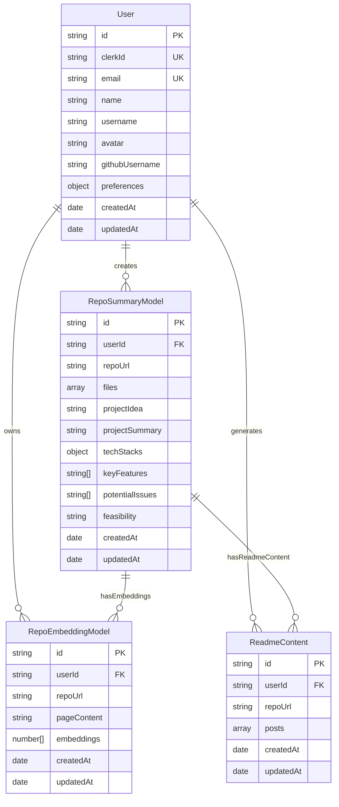

# Nebula 
Nebula transforms complicated repositories into elegant documentation with AI-powered analysis. It automatically generates professional READMEs, technical articles, and social media content from your code, saving countless hours of manual documentation work. With just a URL, unlock comprehensive insights into any repository's architecture, features, and implementation details.

https://github.com/user-attachments/assets/cc7536fc-d537-4a22-a198-315105df3ff4

## REMAINING DEMO VIDEO OF THE PROJECT (WEB3 IMPLEMENTATION)
[VIEW DEMO VIDEO](https://drive.google.com/file/d/1a3ZxPlgpctzU4tKBbkjsQBbFNSNb6YI5/view)

## FULL PPT VIDEO WHICH WAS NOT UPLOADED IN HACKQUEST PLATFORM
[VIEW FULL PITCH VIDEO](https://github.com/user-attachments/assets/550784a7-0c56-4bb0-a4f4-ee1e94973ac9)

**Your code tells a story. We just make sure everyone understands it.**

## ppt
[View ppt](https://docs.google.com/presentation/d/113Yj6llw11j9YufFFc9Kj90Pxq5jBMTREmNhik9NhVw/edit?usp=sharing)

## All repos:
### Nebula
[View Nebula](https://github.com/K-is-SAD/Github)
### Nebula backend
[View Nebula backend](https://github.com/K-is-SAD/Nebula-backend)
### Nebula Contracts
[View Nebula Contracts](https://github.com/K-is-SAD/Nebula-contracts)
### Nebula Daap
[View Nebula Daap](https://github.com/K-is-SAD/nebula-dapp)


## 📑 Table of Contents
- [Overview](#overview)
- [Key Features](#key-features)
- [Demo](#demo)
- [ppt](#ppt)
- [Tech Stack](#tech-stack)
- [System Architecture](#system-architecture)
- [Installation](#installation)
- [Usage](#usage)
- [Project Structure](#project-structure)
- [API Reference](#api-reference)
- [FAQ](#faq)
- [Roadmap](#roadmap)
- [Contributing](#contributing)
- [License](#license)
- [Contact](#contact)


## 🚀 Overview

Nebula is a powerful documentation generation tool that analyzes GitHub repositories and creates comprehensive documentation automatically. The platform uses advanced AI to understand code structure, extract meaningful insights, and generate various documentation formats that are ready to use.

The application addresses the challenge developers face when needing to create and maintain documentation for their projects. Instead of spending hours writing READMEs, technical articles, and other documentation, GitHub ProMax allows you to generate professional content with just one click.

## 🔥 Key Features

- **AI-Powered Repository Analysis**: Deep analysis of code structure, dependencies, and patterns
- **Automated README Generation**: Create professional README files with all necessary sections
- **Technical Article Generation**: Generate detailed technical articles about implementation
- **Content Organization**: Categorize documentation by type and purpose
- **Section-Based Editing**: Easily edit specific sections of your documentation
- **Preview Mode**: See rendered markdown as you work
- **Export Functionality**: Download documentation in markdown format
- **Repository History**: Access previously generated documentation
- **Dark/Light Mode Support**: Comfortable viewing in any environment

## 💻 Tech Stack

- **Frontend**: Next.js, React, TailwindCSS
- **Backend**: Node.js, Express
- **Database**: MongoDB
- **Authentication**: Clerk
- **AI/ML**: Custom NLP models for code analysis
- **Deployment**: Vercel (frontend), Railway (backend)
- **Other Tools**: React Markdown, Lucide Icons
- **web3**: solidity, third-web framework 

## 🏗️ System Architecture



## 📥 Installation

```bash
# Clone the repository
git clone https://github.com/K-is-SAD/Github

# Navigate to project directory
cd Github

# Install dependencies
npm install

# Set up environment variables
cp .env.example .env
# Edit .env with your configuration

# Start the development server
npm run dev
```

Required environment variables:
- `NEXT_PUBLIC_CLERK_PUBLISHABLE_KEY`: Clerk publishable key
- `CLERK_SECRET_KEY`: Clerk secret key
- `MONGODB_URI`: MongoDB connection string
- `WEBHOOK_SECRET`: Secret for webhook verification
- `API_URL`: Backend API URL

## 📖 Usage

### Analyzing a Repository

1. Sign in with your account
2. Navigate to the editor page
3. Click "Set Repository URL" and enter or select a GitHub repository URL
4. The system will analyze the repository and generate documentation
5. Review and edit the generated content as needed
6. Save or export your documentation

### Editing Documentation

1. Use the "Edit" mode to modify content
2. Toggle to "Preview" mode to see how your markdown will render
3. Edit individual sections or the entire document
4. Save your changes with the "Save" button
5. Export to markdown with the "Export" button

### Managing Repository Content

1. Access previously generated content from the sidebar
2. Browse content by category
3. Click on any saved document to view, copy, or delete it
4. Delete all contents for a repository if needed

## 📁 Project Structure

```
github-promax/
├── src/
│   ├── app/
│   │   ├── api/           # API routes
│   │   ├── editor/        # Editor page component
│   │   └── ...
│   ├── components/        # Reusable components
│   │   ├── grids/         # Layout grid components
│   │   └── ...
│   ├── models/            # Database models
│   │   ├── User.ts        # User model
│   │   ├── ReadmeContent.ts # README content model
│   │   ├── repoEmbeddings.ts # Repository embeddings model
│   │   └── reposummary.ts # Repository summary model
│   ├── formats/           # Template formats
│   │   ├── readmeTemplate.md # Template for README
│   │   └── articleTemplate.md # Template for articles
│   └── utils/             # Utility functions
└── ...
```

## 🔌 API Reference

### `GET /api/allrepos`
- **Description:** Fetch all repositories for authenticated user
- **Parameters:** None
- **Headers:** `Authorization: Bearer <token>`
- **Response:** Array of repository objects
- **Example:**
  ```json
  [
    {
      "id": "1",
      "name": "repo-name",
      "url": "https://github.com/user/repo",
      "description": "Repository description"
    }
  ]
  ```

### `POST /api/analyze`
- **Description:** Analyze a GitHub repository
- **Body:**
  ```json
  {
    "repoUrl": "https://github.com/{{username}}/{{repo}}"
  }
  ```
- **Response:** Analysis results
- **Example Response:**
  ```json
  {
    "id": "analysis-123",
    "summary": "Project summary...",
    "techStack": ["React", "Node.js"],
    "features": ["Feature 1", "Feature 2"]
  }
  ```

### `GET /api/readme-content/:repoUrl`
- **Description:** Get README content for a repository
- **Parameters:** Repository URL encoded in the path
- **Response:** Array of README content objects grouped by category
- **Example Response:**
  ```json
  {
    "success": true,
    "data": [
      {
        "_id": "category1",
        "posts": [
          {
            "_id": "post1",
            "content": "# Heading\nContent...",
            "createdAt": "2023-04-20T12:00:00Z"
          }
        ]
      }
    ]
  }
  ```

## 🔍 FAQ

### How do I set up a repository for documentation?
Click the "Set Repository URL" button at the top of the editor and select from your previously analyzed repositories in the dropdown. Once connected, you'll see the repository URL displayed as a pill below the selector.

### Why isn't my markdown preview displaying correctly?
Make sure you're using proper markdown syntax. If code blocks aren't rendering, verify they have the correct triple backtick format with language specification. You can toggle between "Edit" and "Preview" modes using the buttons at the top of the editor.

### How do I save my content?
Click the "Save" button at the bottom of the editor. When successfully saved, you'll briefly see a green "Saved" confirmation message appear. Your content will be stored under the selected repository and category.

### Can I export my documentation?
Yes! Click the "Export" button at the bottom left of the editor to download your content as a markdown (.md) file. The file will be named based on your document title with spaces replaced by hyphens.

### How does section-based editing work?
When content is generated or loaded, it's automatically divided into logical sections based on markdown headings. You can edit each section independently, and changes will be reflected in the full document preview.

## 🛣️ Roadmap

- [ ] GitHub integration for direct commit of documentation
- [ ] Team collaboration features
- [ ] Custom template builder
- [ ] AI-powered documentation recommendations
- [ ] Support for additional documentation formats (PDF, HTML)
- [ ] Enhanced code analysis with security insights
- [ ] Multilingual documentation generation

## 👥 Contributing

Contributions are welcome! Please follow these steps:

1. Fork the repository
2. Create a feature branch (`git checkout -b feature/amazing-feature`)
3. Commit your changes (`git commit -m 'Add some amazing feature'`)
4. Push to the branch (`git push origin feature/amazing-feature`)
5. Open a Pull Request

See the [contributing guidelines](CONTRIBUTING.md) for more details.

## 📜 License

This project is licensed under the MIT License - see the [LICENSE](LICENSE) file for details.

## 📬 Contact

- **Email:** your.email@example.com
- **Discord:** [Join our community](https://discord.gg/invite-link)

---

Built with ❤️ by TEAM OPCODE
