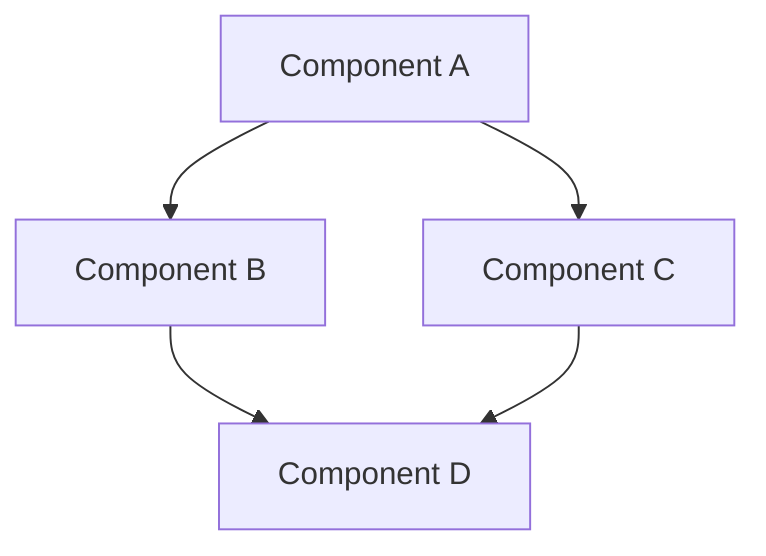

# {{name}}

<!-- AUTO-DESCRIPTION -->
{{description}}
<!-- /AUTO-DESCRIPTION -->

<div align="center">
  


</div>

<div align="center">
  
</div>

## 📑 Table of Contents
- [Overview](#-overview)
- [Key Features](#-key-features)
- [Demo](#-demo)
- [Tech Stack](#-tech-stack)
- [System Architecture](#-system-architecture)
- [Installation](#-installation)
- [Configuration](#-configuration)
- [Usage](#-usage)
- [API Reference](#-api-reference)
- [Database Schema](#-database-schema)
- [Project Workflow](#-project-workflow)
- [Roadmap](#-roadmap)
- [Contributing](#-contributing)
- [Authors](#-authors)
- [Acknowledgments](#-acknowledgments)
- [License](#-license)
- [Contact](#-contact)

## 🚀 Overview
<!-- AUTO-OVERVIEW -->
Provide a concise introduction to your project. Explain the problem it solves, why it's valuable, and its core functionality. Include a screenshot or GIF showing the product in action if possible.

**Problem Statement:**
- Point 1
- Point 2

**Solution:**
- How your project addresses these problems
- What makes your approach unique
<!-- /AUTO-OVERVIEW -->

## ✨ Key Features
<!-- AUTO-FEATURES -->
- **Feature 1:** Detailed explanation of this feature and its benefits
- **Feature 2:** Detailed explanation of this feature and its benefits
- **Feature 3:** Detailed explanation of this feature and its benefits
- **Feature 4:** Detailed explanation of this feature and its benefits
<!-- /AUTO-FEATURES -->

## 🎮 Demo
<!-- AUTO-DEMO -->
Include links to:
- Live Demo: [Demo Link](https://demo-link)
- Video Walkthrough: [YouTube](https://youtube-link)

Or embed screenshots/GIFs showing your application in action:


<!-- /AUTO-DEMO -->

## 💻 Tech Stack
<!-- AUTO-TECHSTACK -->
### Frontend
- Framework: 
- UI Libraries:
- State Management:

### Backend
- Server:
- Authentication:
- APIs:

### Database
- Primary DB:
- Caching:

### AI/ML
- Models:
- Libraries:

### DevOps
- Deployment:
- CI/CD:
- Monitoring:
<!-- /AUTO-TECHSTACK -->

## 🏗️ System Architecture
<!-- AUTO-ARCHITECTURE -->
Include a diagram of your system architecture here using Mermaid, PlantUML, or a simple image.



Provide a brief explanation of the key components and how they interact.
<!-- /AUTO-ARCHITECTURE -->

## 📥 Installation
<!-- AUTO-INSTALLATION -->
```bash
# Clone the repository
git clone https://github.com/{{username}}/{{repo}}.git

# Navigate to project directory
cd {{repo}}

# Install dependencies
npm install

# Set up environment variables
cp .env.example .env
# Edit .env with your configuration

# Start the development server
npm run dev
```

### Prerequisites
- Node.js (v14 or later)
- MongoDB
- Other dependencies...
<!-- /AUTO-INSTALLATION -->

## ⚙️ Configuration
<!-- AUTO-CONFIGURATION -->
Explain what environment variables or configuration files need to be set up:

```
# .env file example
DATABASE_URL=mongodb://localhost:27017/dbname
API_KEY=your_api_key
SECRET_KEY=your_secret_key
PORT=3000
```

Explain any other configuration steps required.
<!-- /AUTO-CONFIGURATION -->

## 📖 Usage
<!-- AUTO-USAGE -->
```javascript
import {{name}} from '{{name}}';

// Initialize
const instance = new {{name}}({
  option1: 'value1',
  option2: 'value2'
});

// Example usage
const result = await instance.analyzeRepository('https://github.com/user/repo');/{{repo}}');
console.log(result);

// Other common operations
instance.generateReadme();
instance.customizeTemplate('template-name');
```
<!-- /AUTO-USAGE -->
Include more detailed examples with explanations for different use cases.
<!-- /AUTO-USAGE -->
<!-- AUTO-API -->
## 📚 API Reference
<!-- AUTO-API -->
### Main Endpointsositories`
- **Description:** Fetch all repositories for authenticated user
#### `GET /api/repositories`
- **Description:** Fetch all repositories for authenticated user
- **Parameters:** Noneof repository objects
- **Headers:** `Authorization: Bearer <token>`
- **Response:** Array of repository objects
- **Example:**
  ```json
  [   "id": "1",
    { "name": "repo-name",
      "id": "1",tps://github.com/user/repo",
      "name": "repo-name",sitory description"
      "url": "https://github.com/user/repo",
      "description": "Repository description"
    }
  ]
  ````POST /api/analyze`
- **Description:** Analyze a GitHub repository
#### `POST /api/analyze`
- **Description:** Analyze a GitHub repository
- **Body:**
  ```jsonUrl": "https://github.com/user/repo"
  {
    "repoUrl": "https://github.com/{{username}}/{{repo}}"
  }*Response:** Analysis results
  ```xample Response:**
- **Response:** Analysis results
- **Example Response:**
  ```json "analysis-123",
  { "summary": "Project summary...",
    "id": "analysis-123",, "Node.js"],
    "summary": "Project summary...",re 2"]
    "techStack": ["React", "Node.js"],
    "features": ["Feature 1", "Feature 2"]
  }
  ```ent other important endpoints...
<!-- /AUTO-API -->
Document other important endpoints...
<!-- /AUTO-API -->hema
<!-- AUTO-DATABASE -->
## 🗃️ Database Schemastructure, showing relationships between collections/tables.
<!-- AUTO-DATABASE -->
Explain your database structure, showing relationships between collections/tables.
erDiagram
```mermaid||--o{ REPOSITORIES : owns
erDiagramITORIES ||--o{ README_CONTENTS : has
    USERS ||--o{ REPOSITORIES : owns : used_by
    REPOSITORIES ||--o{ README_CONTENTS : has
    TEMPLATES ||--o{ README_CONTENTS : used_by
        string id
    USERS {ing email
        string idme
        string email
        string name
    }EPOSITORIES {
        string id
    REPOSITORIES {e
        string idl
        string nameription
        string urlrId
        string description
        string userId
    }EMPLATES {
        string id
    TEMPLATES {name
        string idntent
        string nameId
        string content
        string userId
    }EADME_CONTENTS {
        string id
    README_CONTENTS {toryId
        string idntent
        string repositoryId
        string content
        string templateId
    }
``` additional explanation about important fields or relationships.
<!-- /AUTO-DATABASE -->
Add additional explanation about important fields or relationships.
<!-- /AUTO-DATABASE -->
<!-- AUTO-WORKFLOW -->
## 🔄 Project Workflowrkflow of your application.
<!-- AUTO-WORKFLOW -->
Explain the typical workflow of your application.
sequenceDiagram
```mermaidUser
sequenceDiagram App
    actor Usert API
    participant App
    participant APIHub
    participant DB
    participant GitHubrepository URL
    App->>API: Send analysis request
    User->>App: Enter repository URLata
    App->>API: Send analysis requestt
    API->>GitHub: Fetch repository data
    GitHub-->>API: Repository content
    API->>API: Process with LLM
    API->>DB: Store analysislysis
    API-->>App: Return results
    App-->>User: Display analysis
``` a step-by-step explanation of this workflow.
<!-- /AUTO-WORKFLOW -->
Add a step-by-step explanation of this workflow.
<!-- /AUTO-WORKFLOW -->
<!-- AUTO-ROADMAP -->
## 🛣️ Roadmap1 (Completed)
<!-- AUTO-ROADMAP -->leted)
- [x] Feature 1 (Completed)s - Expected Q2 2023)
- [x] Feature 2 (Completed)Q3 2023)
- [ ] Feature 3 (In Progress - Expected Q2 2023)
- [ ] Feature 4 (Planned - Q3 2023)
- [ ] Feature 5 (Under Consideration)e project and upcoming milestones.
<!-- /AUTO-ROADMAP -->
Describe your long-term vision for the project and upcoming milestones.
<!-- /AUTO-ROADMAP -->
<!-- AUTO-CONTRIBUTING -->
## 🤝 Contributingutions to {{name}}!
<!-- AUTO-CONTRIBUTING -->
We welcome contributions to {{name}}!
2. Create your feature branch (`git checkout -b feature/amazing-feature`)
1. Fork the repository (`git commit -m 'Add some amazing feature'`)
2. Create your feature branch (`git checkout -b feature/amazing-feature`)
3. Commit your changes (`git commit -m 'Add some amazing feature'`)
4. Push to the branch (`git push origin feature/amazing-feature`)
5. Open a Pull RequestING.md](CONTRIBUTING.md) for detailed guidelines on our code of conduct and submission process.
<!-- /AUTO-CONTRIBUTING -->
Please read [CONTRIBUTING.md](CONTRIBUTING.md) for detailed guidelines on our code of conduct and submission process.
<!-- /AUTO-CONTRIBUTING -->
<!-- AUTO-AUTHORS -->
## 👥 Authors** - *Initial work* - [GitHub Profile](https://github.com/{{username}})
<!-- AUTO-AUTHORS -->* - *Role* - [GitHub Profile](https://github.com/contributorusername)
- **Your Name** - *Initial work* - [GitHub Profile](https://github.com/{{username}})
- **Contributor Name** - *Role* - [GitHub Profile](https://github.com/contributorusername) who participated in this project.
<!-- /AUTO-AUTHORS -->
See also the list of [contributors](https://github.com/{{username}}/{{repo}}/contributors) who participated in this project.
<!-- /AUTO-AUTHORS -->
<!-- AUTO-ACKNOWLEDGMENTS -->
## 🙏 Acknowledgmentshose code was used
<!-- AUTO-ACKNOWLEDGMENTS -->
- Hat tip to anyone whose code was used
- Inspiration sourcess
- Libraries and frameworks used
- Mentors and advisors
<!-- /AUTO-ACKNOWLEDGMENTS -->
<!-- AUTO-LICENSE -->
## 📄 Licenseis licensed under the MIT License - see the [LICENSE](LICENSE) file for details.
<!-- AUTO-LICENSE -->>
This project is licensed under the MIT License - see the [LICENSE](LICENSE) file for details.
<!-- /AUTO-LICENSE -->
<!-- AUTO-CONTACT -->
## 📞 Contactebsite:** [website.com](https://website.com)
<!-- AUTO-CONTACT -->terhandle](https://twitter.com/twitterhandle)
- **Project Website:** [website.com](https://website.com)
- **Twitter:** [@twitterhandle](https://twitter.com/twitterhandle))
- **Email:** your.email@example.com- **Discord:** [Join our community](https://discord.gg/invite-link)<!-- /AUTO-CONTACT -->